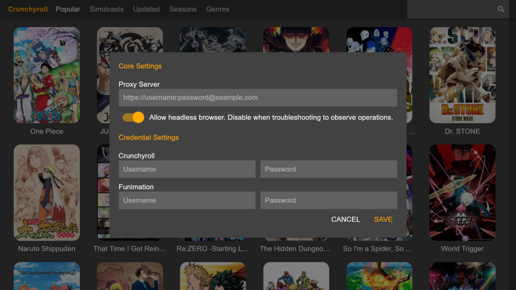

# AnimeLoyalty

Your personal anime collection on your device. Your content, your rules.

## What is AnimeLoyalty?

*AnimeLoyalty* is an anime download- and streaming application. You can stream anime directly from your favourite streaming services, or download anime to watch later. Downloaded anime is stored in the original video format (`h264` in a `mp4` container) and bundled with the subtitles in a `mkv` container. (**WARNING**: Downloading is not yet available in the desktop preview).

### Legal Warning

This application is not endorsed or affliated with any streaming service. The usage of this application may be forbidden by law in your country. Usage of this application may cause a violation of *Terms of Service* between you and the streaming service. This application is not responsible for your actions.

### Screenshots

    
    
    

## Installation

### Desktop (Preview)

The *AnimeLoyalty* desktop application is in **preview**. Please see [this issue for details](https://github.com/animeloyalty/animeloyalty/issues/5).

#### Install on Windows

1. [Download the latest Windows installer](https://github.com/animeloyalty/animeloyalty/releases/download/v0.13.0/animeloyalty-Setup-0.13.0.exe).
2. Run the installer. *Windows* will block the installation.
3. Click on *More Info* and then click on *Run anyway*.
4. Enjoy *AnimeLoyalty*!

#### Install on Mac

1. [Download the latest Mac installer](https://github.com/animeloyalty/animeloyalty/releases/download/v0.13.0/animeloyalty-0.13.0.dmg).
2. Run the installer. Drag *animeloyalty* to *Applications*.
3. Run *animeloyalty*. *Mac* will block the application.
4. Open *Security & Privacy*. Click on the *Lock* icon to make changes.
5. Click on the *Allow* button next to the message about *animeloyalty*.
6. Run *animeloyalty*. Enjoy!

#### Install on Linux

1. [Download the latest Linux image](https://github.com/animeloyalty/animeloyalty/releases/download/v0.13.0/animeloyalty-0.13.0.AppImage).
2. Make the *animeloyalty* *AppImage* executable.
3. Run *animeloyalty*. Enjoy!

### Developer Interface (CLI)

See https://github.com/animeloyalty/animesync.

## Contributions

While software contributions are welcome, you can also help with:

* Documentation
* Helping other people
* Feature requests
* Bug reports

## Questions?

Please make an issue if you have questions, wish to request a feature, etc.
